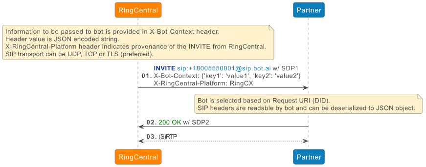
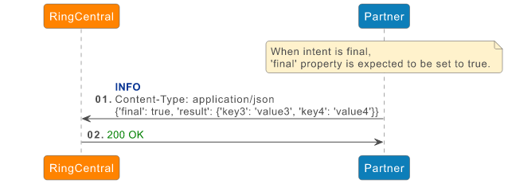
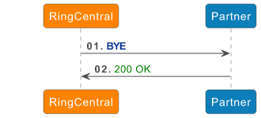

# Introduction

This guide describes an interface between RingCentral and the Bot Partner Platform based on the SIP protocol.

SIP offers a standard way of establishing audio streams between two parties as well as a way of pathing data between parties.

Advantages:

* Simple method of integration minimizing race conditions
* Allows developers to reuse existing SIP based security mechanisms: SRTP, sips, SBC, SIP trunks, IP whitelisting

Limitations:

* Potential issues with the size of the custom data

# Implementation

The following guide for developers helps developer connect, update, and disconnect a bot from the interaction.

## Bot Connection

SIP transport between RingCentral and Partner can be:

* UDP
* TCP 
* TLS (recoommended)

!!! Note
    Recommended transport is TLS.
    When using TLS, RingCentral will try negotiating encrypted media (RTP/SAVP). 

Currently, bot selection is based on the Request-URI user part (aka DID).

Bot selection can also be based on a specific SIP header (header name TBD).

In general, SIP headers shall be available from the bot flow engine.

### Authentication between RingCentral and Bot Partner Platform

There is no authentication mechanism per say. A typical implementation would rely on IP address whitelisting. The required list of RingCentral public IP addresses that are used to establish SIP dialog with bot are documented in the IP Supernets section of the [Ring Cental Network Requirements Documentation](https://support.ringcentral.com/article-v2/Network-requirements.html?brand=RingCentral&product=RingEX&language=en_US)

## Bot Update

At any point during the flow, a bot can provide data to RingCentral. Data exchange between the developer and RingCentral is based on SIP INFO message. Data can be provided in the SIP INFO payload. Currently a JSON-encoded payload is the only format supported. In this case, Content-Type header is set to application/json.

The bot flow shall allow the end-user specifying the JSON data.

When providing a final intent, JSON ‘final’ property is expected to be set to true.

## Bot Disconnection

Although a developer may disconnect their bot at any time, it is expected that the disconnection will be initiated by RingCentral, after final intent is received from bot. A simple BYE request is used to disconnect the bot.

# Connection Reuse

With TCP or TLS transport, RingCX establishes the connection toward the 3rd-party bot destination, and an INVITE message is sent over that establishes the connection. In this case, RingCX does not expect (and does not support) receiving SIP messages (neither responses to the INVITE nor in-dialog requests) on the provided address specified in Contact header. Instead, any SIP message from the bot is expected to be sent to RingCX over the established TCP/TLS connection.

In order to keep the connection alive, RingCX periodically sends a “ping” packet as described in [RFC 5626](https://datatracker.ietf.org/doc/html/rfc5626#section-4.4.1). It is not required for the 3rd-party bot to reply with a “pong” message.
