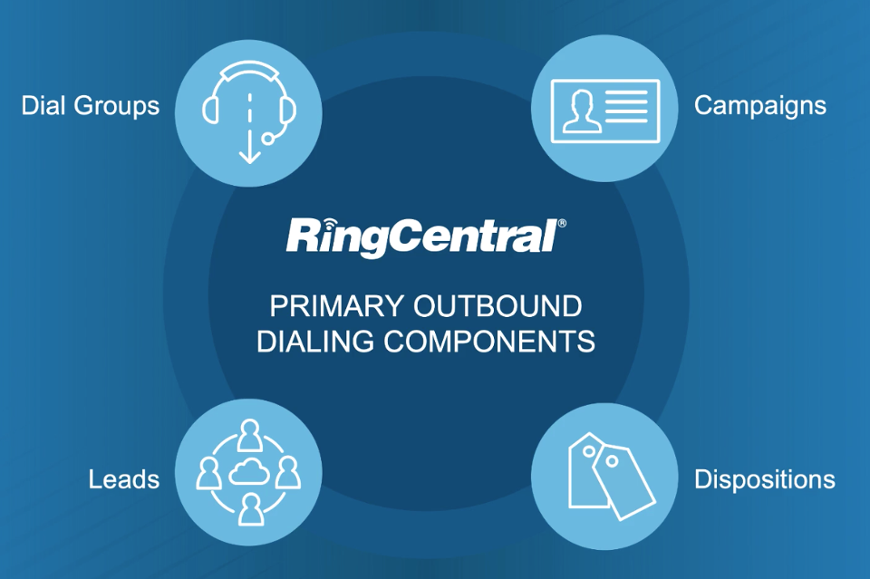

# Introduction to Dialing APIs

Outbound calling activities can be planned and managed effectively with RingCX dialing components. These components help define outbound calling objectives, support agent performance, improve customer service, and provide quality reporting.

-   Dialing groups determine the dialing mode, or how a call will be made.

-   Campaigns are nested within dialing groups and define the purpose of the outbound call.

-   Leads are the contacts or customers that the campaign will dial.

-   Dispositions allow agents to mark the outcome of a call.

Dialing components require several related configuration steps. The Campaigns, Leads, and related APIs can fully or partially automate outbound dialing setup, which is especially useful when importing lead data from external systems such as a CRM.

## Popular Use Cases and Documentation

  

    

      <h5 class="card-title">Create Dial Groups</h5>
      <h6 class="card-subtitle mb-2 text-muted">Dial Groups API</h6>
      
Dial groups are configurable groups of (outbound) campaigns that can be differentiated by the type of dialer you are using.

      <ul class="pl-0 ml-4">
      <li><a href="./quick-start" class="card-link">Create Dial Groups Quick Start</a></li>
      <li><a href="./campaigns/dial-groups" class="card-link">Manage Dial Groups</a></li>
      </ul>
    

  

  

    

      <h5 class="card-title">Create Outbound Campaigns</h5>
      <h6 class="card-subtitle mb-2 text-muted">Campaigns API</h6>
      
Campaigns are a way to organize and manage the different types of outbound calls leaving your contact center. You can configure campaigns by creating custom agent dispositions, uploading lead, setting schedules for dialing, activating compliance-supporting tools, and more.

      <ul class="pl-0 ml-4">
      <li><a href="./campaigns/campaigns" class="card-link">Manage Campaigns</a></li>
      </ul>
    

  

  

    

      <h5 class="card-title">Bulk Load Leads</h5>
      <h6 class="card-subtitle mb-2 text-muted">Campaign Loader API</h6>
      
Leads are arranged into a JSON body and uploaded into campaigns for agents to dial on.

      <ul class="pl-0 ml-4">
      <li><a href="./leads/bulk-import" class="card-link">Manage Leads</a></li>
      </ul>
    

  

  

    

      <h5 class="card-title">Search Leads</h5>
      <h6 class="card-subtitle mb-2 text-muted">Lead Search API</h6>
      
Find leads using Primary Search Fields and Extended Search Fields.

      <ul class="pl-0 ml-4">
      <li><a href="./leads/search" class="card-link">Search for Leads</a></li>
      </ul>
    

  

