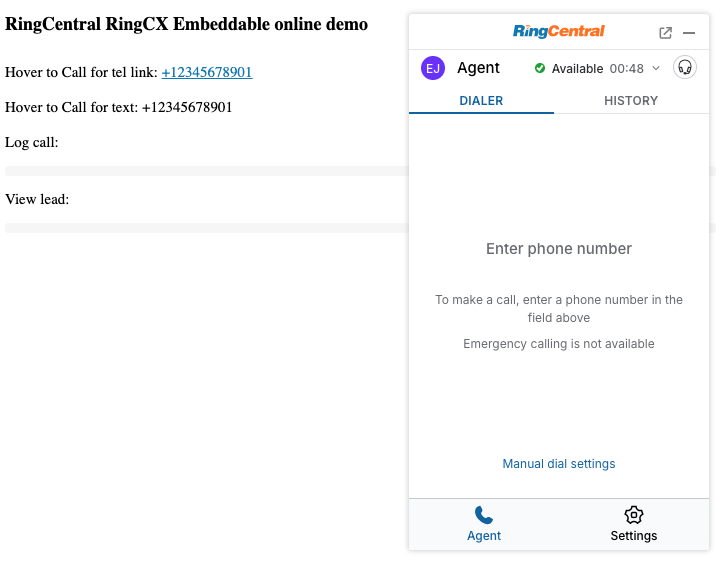

# RingCX Embeddable

## Introduction

RingCX Embeddable is an out-of-the-box embeddable web application that help developers to integrate RingCentral RingCX services to their web applications with a few lines of code.

> **This is a beta release.** We welcome your feedback and bug reports — please feel free to open an issue on [GitHub](https://github.com/ringcentral/engage-voice-embeddable/).

## Supported features

* Agent states
* Voice queues
* Dial modes
    * Manual
    * Predictive dial mode
    * Preview dial mode
* Call disposition
    * Notes
    * Disposition
    * AI Summary

## Visit Online

Visit the online demo: [https://cdn.labs.ringcentral.com/ringcx-embeddable/1.0.0/index.html](https://cdn.labs.ringcentral.com/ringcx-embeddable/1.0.0/index.html)



## Inject into Web app

Add the following code into any web app's page to make it work:

```html
<script>
  (function() {
    var rcs = document.createElement("script");
    rcs.src = "https://cdn.labs.ringcentral.com/ringcx-embeddable/1.0.0/adapter.js";
    var rcs0 = document.getElementsByTagName("script")[0];
    rcs0.parentNode.insertBefore(rcs, rcs0);
  })();
</script>
```

Once injected, you can interact with the widget through the global `RCAdapter` object, for example to start a call:

```js
RCAdapter.clickToDial(phoneNumber);
```

You can also register a logger and contact matcher service to listen to events from the widget and log calls or match contacts:

```js
var registered = false;
window.addEventListener('message', function(event) {
  var message = event.data;
  if (!registered && message && message.type === 'rc-ev-init') {
    registered = true;
    RCAdapter.registerService({
      name: 'TestService',
      callLoggerEnabled: true,
      contactMatcherEnabled: true, // match contact with phone number
      callLogMatcherEnabled: true, // match call log entity with call id
      leadViewerEnabled: true, // add "view lead" button
    });
    RCAdapter.transport.addListeners({
      push: function (data) { // listen push event from rc widget
        // new call event
        if (data.type === 'rc-ev-newCall') {
          console.log('new call:', data.call);
        }
        if (data.type === 'rc-ev-ringCall') {
          console.log('ringing call:', data.call);
        }
        // lead events
        if (data.type === 'rc-ev-loadLeads') {
          // agent fetch leads event
          console.log(data.leads);
        }
        if (data.type === 'rc-ev-callLead') {
          // agent call lead event
          console.log(data.lead);
          console.log(data.destination); // phone number
        }
        if (data.type === 'rc-ev-manualPassLead') {
          // agent pass lead event
          console.log(data.lead);
          console.log(data.dispositionId);
          console.log(data.notes);
          console.log(data.callback); // if need to call back
          console.log(data.callbackTime); // call back time
        }
      },
      request: function (req) { // listen request event from rc widget
        var payload = req.payload;
        // handle log request
        if (payload.requestType === 'rc-ev-logCall') {
          console.log('logCall:', payload.data);
          RCAdapter.transport.response({
            requestId: req.requestId,
            result: 'ok',
          });
          return;
        }
        // handle match contacts request
        if (payload.requestType === 'rc-ev-matchContacts') {
          var queries = payload.data;
          console.log('matchContacts:', queries);
          var contactMapping = {};
          queries.forEach(function (query) {
            contactMapping[query.phoneNumber] = [{
              id: query.phoneNumber,
              type: 'TestService',
              name: 'Test User ' + query.phoneNumber,
              phoneNumbers: [{
                phoneNumber: query.phoneNumber,
                phoneType: 'direct',
              }]
            }]; // Array
          });
          RCAdapter.transport.response({
            requestId: req.requestId,
            result: contactMapping,
          });
          return;
        }
        // handle match call logs request
        if (payload.requestType === 'rc-ev-matchCallLogs') {
          var queries = payload.data;
          console.log('matchCallLogs:', queries);
          var callLogMapping = {};
          // match the logged call entity
          callLogMapping[queries[0]] = [{
            id: your_logged_call_entity_id, // logged call entity id
          }];
          RCAdapter.transport.response({
            requestId: req.requestId,
            result: callLogMapping,
          });
          return;
        }
        // handle view lead request
        if (payload.requestType === 'rc-ev-viewLead') {
          var lead = payload.data;
          console.log('agent want to view lead: ', lead);
          RCAdapter.transport.response({
            requestId: req.requestId,
            result: 'ok',
          });
          return;
        }
      }
    });
  }
});
```

See [API](https://github.com/ringcentral/engage-voice-embeddable/blob/1.x/docs/api.md), [Message Transport](https://github.com/ringcentral/engage-voice-embeddable/blob/1.x/docs/message-transport.md) and [Call Events](https://github.com/ringcentral/engage-voice-embeddable/blob/1.x/docs/call-events.md) for the full message and event reference.

## Documentation

Check source code from the [RingCX Embeddable GitHub repository](https://github.com/ringcentral/engage-voice-embeddable/). See the following guides for full details:

* [Get Started](https://github.com/ringcentral/engage-voice-embeddable/blob/1.x/docs/get-started.md)
* [Customize Client ID and environment](https://github.com/ringcentral/engage-voice-embeddable/blob/1.x/docs/customize-client-id.md)
* [Customize Redirect Uri](https://github.com/ringcentral/engage-voice-embeddable/blob/1.x/docs/customize-redirect-uri.md)
* [Customize Authorization](https://github.com/ringcentral/engage-voice-embeddable/blob/1.x/docs/customize-authorization.md)
* [API](https://github.com/ringcentral/engage-voice-embeddable/blob/1.x/docs/api.md)
* [Message Transport](https://github.com/ringcentral/engage-voice-embeddable/blob/1.x/docs/message-transport.md)
* [Call Events](https://github.com/ringcentral/engage-voice-embeddable/blob/1.x/docs/call-events.md)
* [Popup a standalone widget](https://github.com/ringcentral/engage-voice-embeddable/blob/1.x/docs/popup-window.md)
* [Migrating from 0.x (Legacy) to 1.0 (Beta)](https://github.com/ringcentral/engage-voice-embeddable/blob/1.x/docs/migration-from-0.x.md)
