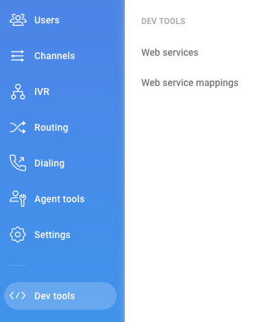
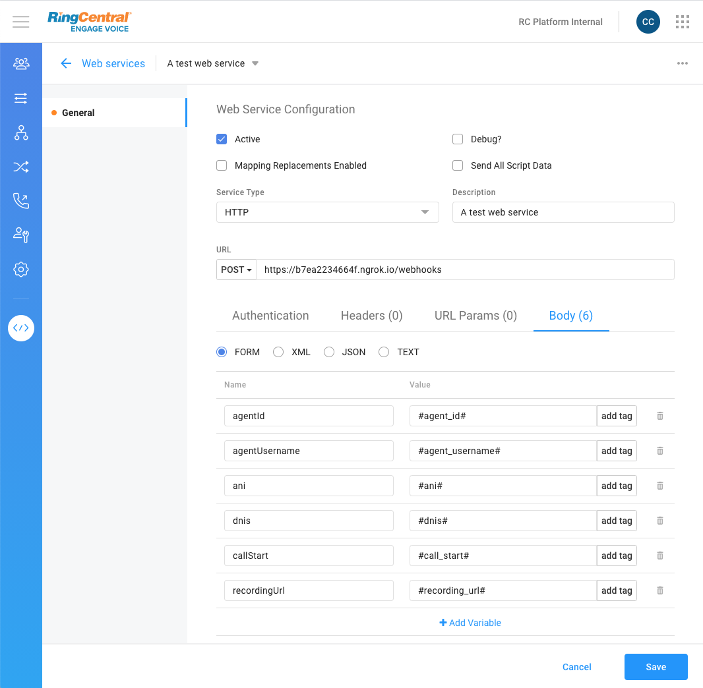
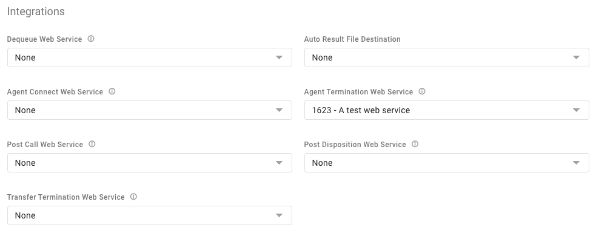
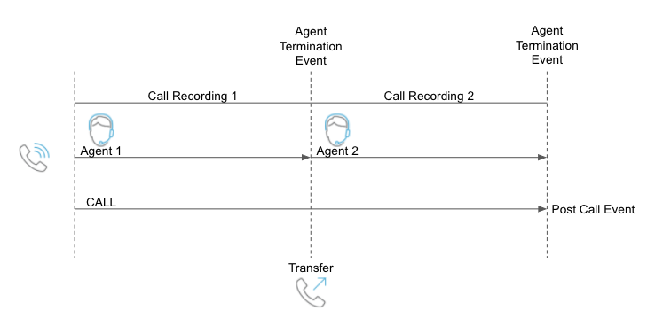

# About Web Services (Webhooks)

Web services, such as those based on the SOAP or HTTP protocols, talk to each other or talk to client applications that invoke them. These web services have collections of data elements that we collect in real time, ready to synchronously stream to an identified endpoint URL. When configuring a web service, you will define the data points to send, the place to send them to, and the name and operations of the web service. Here are more details about [RingCX Web Services](https://support.ringcentral.com/engagevoice/admin/voice-admin-intro-web-services.html)

After you configure a web service, you can set up your campaigns or queues to invoke web services at various points in a call’s lifecycle. The invocation of a web service is done through a webhook, which is a trigger. By doing so, you can stream real-time or near real-time data to other web-based computing systems while calls are in progress. Follow the link to learn more about [setting up webhooks](https://support.ringcentral.com/engagevoice/admin/voice-admin-set-up-webhooks.html).

## Example of Using Web Service with Webhooks

Let's say you want to receive call details, including the call recording, once a call is completed. We can create a web service to connect to your endpoint and send the call details including a call recording link. This web service would trigger at the end of an inbound or outbound call.

### Setting up a Web Service

Please see the guide to [setup a web service](https://support.ringcentral.com/engagevoice/admin/voice-admin-configure-http-web-service.html) for a general use case. In this example, we'll walk through how to setup a web service for sending call details and call recordings specifically.

Create a new Web Service group by going to **Dev tools**, and then selecting **Web services**. Within this new Web Services Group, create a **new web service**.



Since we are sending information to an endpoint, we'll want to `POST` these details to your URL endpoint. For this example, we'll put in a few common data elements to send for both inbound and outbound calls. Here are a few key settings:

| Field | Type | Value |
|-|-|-|
| Active | checkbox | checked |
| Service Type | dropdown | `HTTP` (note the other option is SOAP for older implementations)|
| Description | form field | Put the name of your web service here. This name is what we'll use to link to our webhook later. For this example, we are calling it "A test web service". |
| URL | dropdown | `POST` (you can try other HTTP methods, but for our example we are using `POST`). |
| URL | form field | The endpoint you wish to send your message to. In this example, we are using an ngrok service, but you'll have to create your own. |

| Parameter |  Description |
|-|-|
| agent_id | This is an internal identifier for the agent. |
| agent_username | The username for this agent, usually comprised of email address. |
| ani | The number of the customer. |
| dnis | The agent's number, or the number the customer called to reach the agent. |
| call_start | The date and time the call was started using ANSI SQL 92 format such as `2020-04-22 00:00:00.0000`. |
| recording_url | A URL to the recording file. The file is provided in WAV format. Call recording URLs can be secured using basic authentication or accessible anonymously without authentication.



Alternatively, you can send a JSON body instead of form data as shown above. Be sure to surround both your name and value with double quotes when submitting a JSON body.

```json
{
  "agentId": "#agent_id#",
  "agentUsername": "#agent_username#",  
  "ani": "#ani#",
  "dnis": "#dnis#",
  "callStart": "#call_start#",
  "duration": "#duration#",
  "recordingUrl": "#recording_url#"
}
```

!!! Note
    When selecting the **Debug?** option, the details of the web service call will be stored in debug format on the RingCX server. Access to the logged information must be requested through Operations as they are not directly accessible.

### Setting up Webhooks (Events)

A Webhook is triggered as an event for a certain condition. For details in [setting up webhooks](https://support.ringcentral.com/engagevoice/admin/voice-admin-set-up-webhooks.html), follow the instruction on the support page.  In this example, since we want the call details right after the call has ended (either by the caller or the agent), we will connect our web service to the **Agent Termination Web Service** event.  



!!! Important Note
    Some calls may have multiple agent sessions (legs or segments). For example, when an agent transfers a call, the agent's segment may end prior to the end of a call. In these instances, a call can be comprised of multiple agent segments. Since there is a recording per agent segment, it's better to receive each recording separately to know which agent segment the recording belongs to.<br>
    

That's all! Go ahead and test your web service and webhook out by making a call to your queue. Once you hang up the call, the event will trigger and the message is sent to your endpoint.

### Special Case of Agent Recordings (Dual Channel)

Agent recordings are in dual channel so you can separate the agent speaking in one channel and the customer speaking on the other channel. This type of special recording mode is available to customer accounts.

!!! Important Note
    Before you can configure and access your agent recordings, you need to have it enabled in your account. Contact your CSM for more information on activating agent recording.

Once enabled, you may use the `#sess_agent_perspective_recording_url#` tag to send the agent recording link.

!!! Note
    The Agent Recording tag is only available manually and not selectable from the drop down tag list.  
