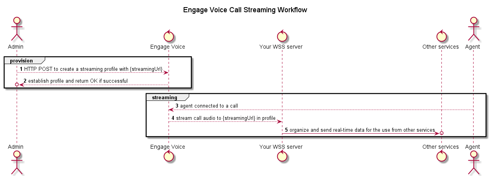

# Introduction to Call Streaming

!!!important
    Please work with your RingCentral representative to activate Call Streaming service for your organization.

**Call Streaming** runs alongside [Call Recording](./../call-recording). It streams real-time stereo audio to your WebSocket Secure(WSS) server, which can then be used for services like Speech Analysis etc.

!!!important
    Call Streaming requires a WSS server built and run by you. The server is used to receive audio streams for further processes. A [basic sample](#sample-code) is provided below.

## Workflow Overview



## Provision Streaming Profile

Call Streaming provision is per **Queue(inbound calls)/Campaign(outbound calls)**. The streaming service is activated upon the creation of a streaming profile.

To create a streaming profile, use HTTP POST request to `{BASE_URL}/media-distributor/product`.

###  Request

Be sure to set the proper [BASE_URL](../../../basics/uris/#resources-and-parameters) and [authorization header](../../../authentication/auth-ringcentral) for your deployment.

| API Property | Description |
|-|-|
| **`productType`** | QUEUE or CAMPAIGN |
| **`streamingUrl`** | The url for your WSS server which should start with `wss:` **NOT** `ws:` |
| **`secret`** | Optional. You can use it for your server side validation for incoming websocket messages. |

=== "HTTP"
    ```bash
    POST /api/v1/media/product
    Authorization: bearer <myAccessToken>
    Content-Type: application/json;charset=UTF-8
    Accept: application/json

    {
        "productType": "QUEUE",
        "productId": 0,
        "subAccountId": "string",
        "mainAccountId": "string",
        "rcAccountId": "string",
        "streamingUrl": "string",
        "secret": "string"
    }
    ```

### Response

```json
{
    "productType": "QUEUE",
    "productId": 0,
    "subAccountId": "string",
    "mainAccountId": "string",
    "rcAccountId": "string",
    "streamingUrl": "string",
    "secret": "string"
}
```

## Streaming

Now that we have a streaming profile for a Queue/Campaign. When an agent in this Queue/Campaign is connected to a call, Engage Voice server will start to send websocket messages to `streamingUrl`. There are 4 types of messages:

- [Connect](#connect-message)
- [Start](#start-message)
- [Media](#media-message)
- [Stop](#stop-message)

!!!note
    If the websocket initiation request is accepted, we will begin sending messages. If the websocket initiation is denied, we will receive a 4xx error and not proceed. If the websocket initiation fails with a 5xx error, we will attempt to retry up to 3 attempts.

### Connect Message

!!!note
    Before sending Connect Message, there will be a HTTP request for websocket upgrade handshake, with the following query parameters that can be parsed and stored on your system as needed: `Call ID`, `Session ID`, `Caller ANI`, `DNIS`, `EV Account ID`, `EV Subaccount ID`, `RingCentral Office Account ID`, `Agent ID`, `Product Type(Queue|Campaign|Manual)`, `Product ID`

Connect Message will be sent once websocket connection is established.

```json
{ 
 "event": "Connected", 
 "protocol": "AgentSession", 
 "version": "1.0.0" 
}
```

### Start Message

Start Message will be sent right after Connect Message. It contains the metadata of your stream.

```json
{ 
 "event": "Start", 
 "metadata": {
    "callId": "12345", 
    "sessionId": 2, 
    "ani": "2223334444", 
    "dnis": "2223334444", 
    "accountId": "99990000", 
    "subaccountId": "99990001", 
    "rcAccountId": "123456789", 
    "agentId": 123, 
    "productType": "Queue", 
    "productId": 1234, 
    "contentType": "audio/x-mulaw", 
    "sampleRateHertz": 8000, 
    }
}
```

### Media Message

Media Message is the primary message type you will receive and it will sent continuously. It contains the audio data of your stream.

```json
{ 
    "event": "Media", 
    "perspective": "Participant" | "Conference", 
    "sequenceId": "1",   
    "media": "{base64_encoded_binary_data}" // media field will contain the binary data for about 20ms of audio.
}
```

!!!note
    In stereo channels, the left channel will be agent's audio, and the right channel will have audio for caller and all other existing legs from transfers/requeues.

### Stop Message

Stop Message is sent at the end of the call and contains relevant metadata. We will send a stop message for each perspective of the call.

```json
{ 
    "event": "Stop", 
    "metadata": {
        "duration": 120, 
        "end_time": "2021-01-14T00:00:00Z" //RFC-3339 format timestamp 
    }
} 
```

### Sample Code

=== "python"
```python
import argparse
import asyncio
import json
import logging
import websockets
import wave
import base64
from pathlib import Path


logging.basicConfig(level=logging.INFO)

streaming_sessions = {}

receive = ""
transmit = ""
recording_directory = "./recordings/"

def log_message(message: str) -> None:
    logging.info(f"Message: {message}")

def consumeStartMessage(message, streaming_session) -> None:
    logging.info("Received a START Message for session_id " + streaming_session["id"])
    global transmit
    transmit = wave.open(recording_directory + streaming_session["id"] + "_conference.wav", mode='wb')
    transmit.setnchannels(1)
    transmit.setsampwidth(1)
    transmit.setframerate(11000)

    global receive
    receive = wave.open(recording_directory + streaming_session["id"] + "_agent.wav", mode='wb')
    receive.setnchannels(1)
    receive.setsampwidth(1)
    receive.setframerate(11000)
    log_message(message)

def consumeMediaMessage(message, streaming_session) -> None:
    logging.info("Received MEDIA Message for session_id " + streaming_session["id"])
    media = message["media"]
    logging.info(media)
    media_bytes = base64.b64decode(media)
    logging.info(type(media_bytes))
    if message["perspective"] == "Participant" :
        receive.writeframes(media_bytes)


    if message["perspective"] == "Conference" :
        transmit.writeframes(media_bytes)
    log_message(message)


def consumeStopMessage(message, streaming_session) -> None:
    logging.info("Received STOP Message for session_id " + streaming_session["id"])
    receive.close()
    transmit.close()
    log_message(message)

def build_session(message, websocket) -> None:
    streaming_session = {"metadata": {}, "id": ""}
    streaming_sessions[websocket] = streaming_session
    streaming_session["metadata"] = message["metadata"]
    streaming_session["id"] = str(streaming_session["metadata"]["callId"]) + "-" + str(streaming_session["metadata"]["sessionId"])

async def handle(websocket, path):
    logging.info("we got a message")
    logging.info(path)
    async for messageStr in websocket:
        logging.info(messageStr)
        message = json.loads(messageStr)
        if message["event"] is not None and message["event"] == "Connected":
            logging.info("Consumed ACK")
        elif message["event"] is not None and message["event"] == "Start":
            build_session(message=message, websocket=websocket)
            consumeStartMessage(message, streaming_session=streaming_sessions[websocket])
        elif message["event"] is not None and message["event"] == "Media":
            consumeMediaMessage(message, streaming_session=streaming_sessions[websocket])
        elif message["event"] is not None and message["event"] == "Stop":
            consumeStopMessage(message, streaming_session=streaming_sessions[websocket])
            break


if __name__ == '__main__':
    parser = argparse.ArgumentParser(description='Starts up a SimpleWebSocket Server, will send messages to all conencted consumers')
    parser.add_argument('--port',"-p", help='port number of the producer sending websocket data')
    parser.add_argument('--hostname',"-n", help='hostname of the producer websocket')

    args = parser.parse_args()

    if args.hostname is None:
        logging.info('No Hostname was supplied, defaulting to 127.0.0.1')
        args.hostname = '127.0.0.1'

    if args.port is None:
        logging.info('No port was supplied, defaulting to 3333')
        args.port = 3333

    Path(recording_directory).mkdir(parents=True, exist_ok=True)
    start_server = websockets.serve(handle, args.hostname, args.port, ping_interval=1, ping_timeout=500000)
    logging.info("Server started on host: " + args.hostname + ":" + str(args.port))
    loop = asyncio.get_event_loop()                                                                                         
    loop.run_until_complete(start_server)
    loop.run_forever()
```

!!!note
    [Extra Info](https://docs.python.org/3/library/ssl.html) on running WebSocket Secure server with self-assigned SSL